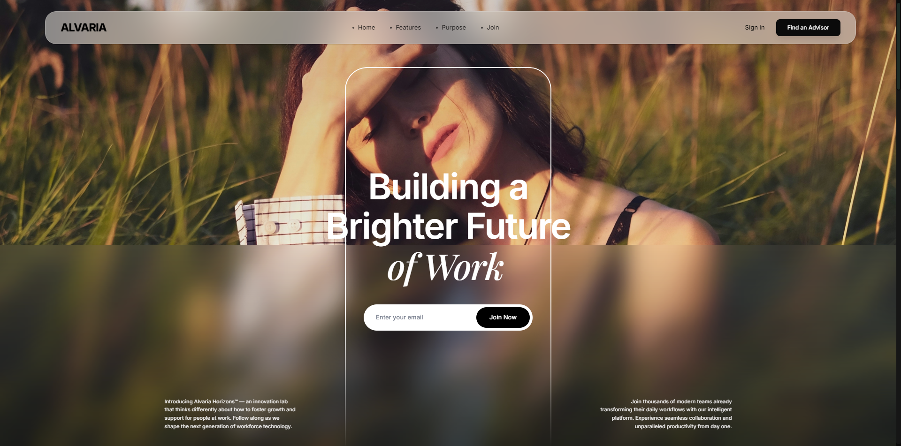
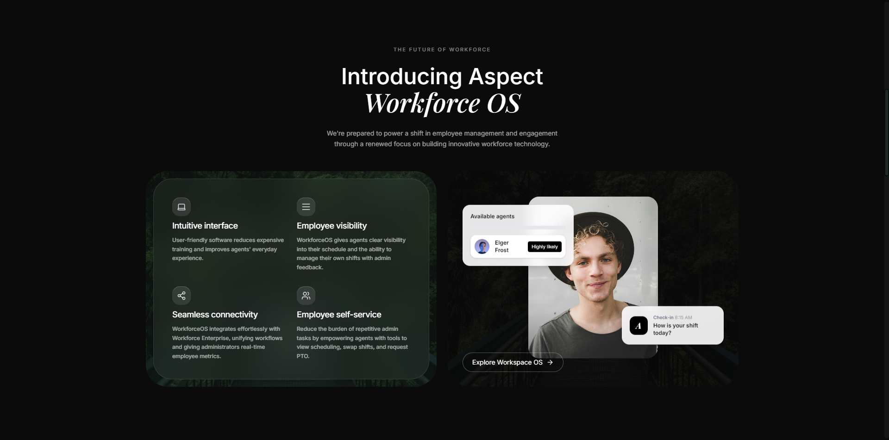
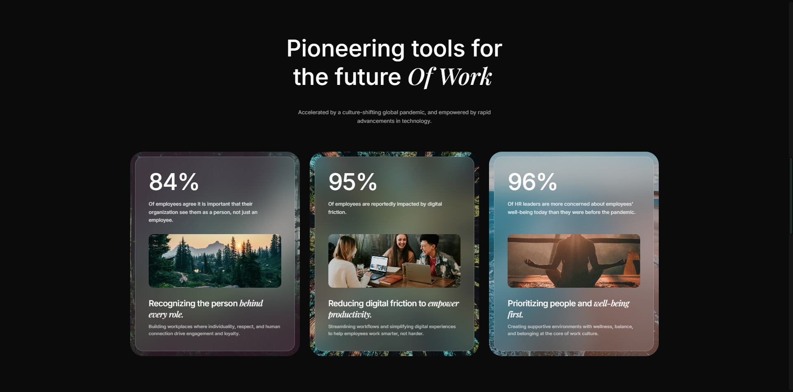
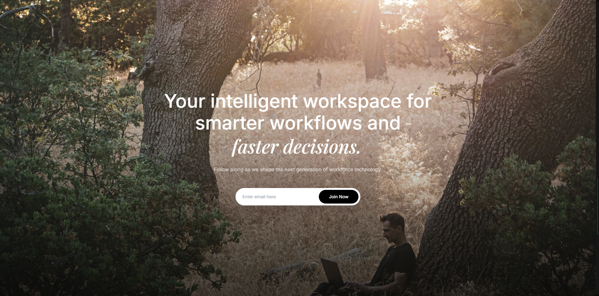
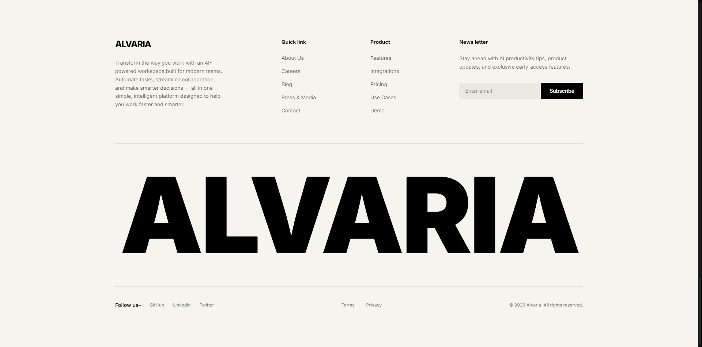

<div align="center">

</div>

# ALVARIA

This is a **vibe coded** landing page built with **Google Gemini** and **Google AI Studio**, taking inspiration from this [Dribbble design](https://dribbble.com/shots/27304934-Workspace-website-design).

## Frameworks & Technologies Used

- **React** (v19) - Core UI library
- **Vite** - Frontend build tool
- **Tailwind CSS** (v4) - Utility-first CSS framework
- **Framer Motion** (`motion/react`) - Production-ready motion library
- **Lucide React** - Icon library
- **TypeScript** - For type-safe development

## Run Locally

**Prerequisites:** Node.js

1. Install dependencies:
   ```bash
   npm install
   ```
2. Run the development server:
   ```bash
   npm run dev
   ```

## Key Features

- **Cinematic UI**: Luxury glassmorphism and deep blurs for a premium "Vibe Coded" aesthetic.
- **Scroll Snap Architecture**: Precise section snapping using `100dvh` viewport logic.
- **Dynamic Navigation**: "Scroll-up" visible navbar with an integrated full-screen mobile overlay.
- **Responsive Motion**: Viewport-aware animations optimized for all device categories.

## Screenshots

<div align="center">
  
  
  
  
  
</div>
